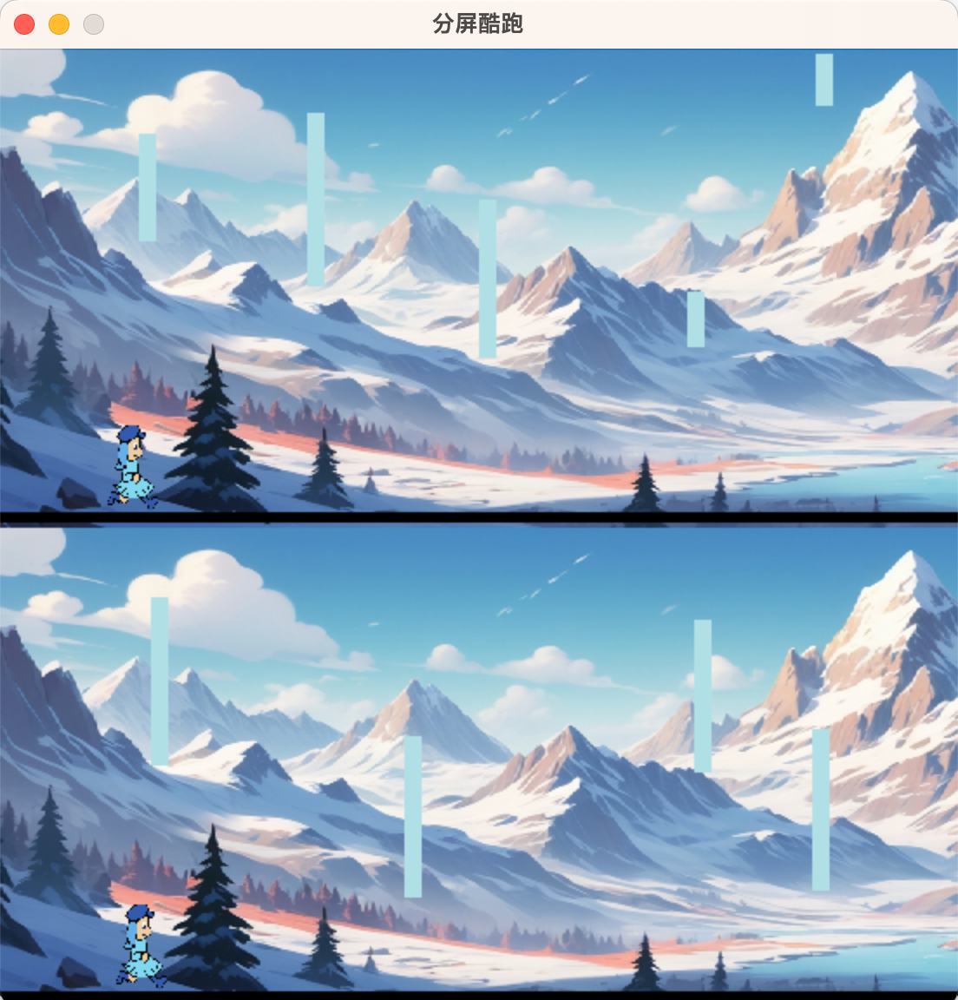

# pygame 小游戏 —— RunnerMan

基于 pygame 开发的一个酷跑类的小游戏，分了两下两个赛道，需要同时控制上下两个人物来越过障碍。



## 游戏说明

1. 上面的赛道通过按键`w`控制跳跃，下面的赛道通过按键`u`控制跳跃。
2. 按`esc`或者`q`结束游戏

## 运行

``` python
pip install pygame
python main.py
```

